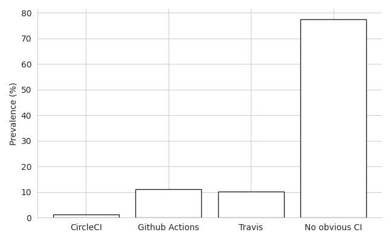

# JOSS CI Coverage

This is a project with the aim of discovering the number of papers submitted to JOSS which have some kind of CI set up.

**Read [the blog post](http://blog.jamiejquinn.com/analysing-ci-in-joss)** for a better understanding than this README provides.

## Logbook

Using BeautifulSoup to scrape the [JOSS index](https://joss.theoj.org/papers?page=1) and produce a set of urls, one for each paper in the journal.

Turns out only the ID on the end of the url is unique so we can use this as an ID for e.g. make:

`cat paper_url_list.txt | sed 's/"//g' | sed 's/, /\n/g' | awk -F. '{print $5}' > id_list.txt`

Discovered the $* automatic variable in make! Fills in the '%' match from the target.

We can find the different source code repository hosts using

`cat *.json | sed 's/, /\n/g' | grep repo_url  | awk -F'/' '{print $3}' | sort | uniq -c`

```
   17 bitbucket.org
    1 c4science.ch
    1 doi.org
    1 framagit.org
 1086 github.com
    1 git.iws.uni-stuttgart.de
   22 gitlab.com
    1 gitlab.gwdg.de
    3 gitlab.inria.fr
    1 gricad-gitlab.univ-grenoble-alpes.fr
    1 marcoalopez.github.io
    1 mutabit.com
    1 savannah.nongnu.org
    1 sourceforge.net
    3 ts-gitlab.iup.uni-heidelberg.de
    1 www.idpoisson.fr
```

I think this suggests we can get fairly valid statistics from concentrating only on scraping Github.

## Results

Of the 1112 papers analysed, just under 25% of them use one of the more popular CI platforms. Even assuming our False signal is overly sensitive to a degree, this is indicative of a large portion of scientific code not using any form of CI.



Raw numbers:
```
 13 circle-ci
845 False
 50 github-actions
 72 github-folder
 55 not-github
110 travis
```

## Checking for Github's green tick

Github's green tick is a way for GH to show whether a specific commit has passed CI-run tests (e.g. through travis/github actions). There are some browser extensions which use the presence of this to determine whether a codebase has CI enabled. I managed to scrape not just the presence of the tick from GH but any icon at all which indicates whether a repo has CI enabled. The results are depressing:
```
    3 circle-ci
 1063 False
   15 github-actions
   55 not-github
    8 travis
    1 Unknown
```

Here, if the CI icon (tick, cross, doesn't matter) is present, the code attempts to determine which CI platform is being used. So that's 1063 repos *without* an icon at all which means even if they have set up CI, it hasn't run on their latest commit...
